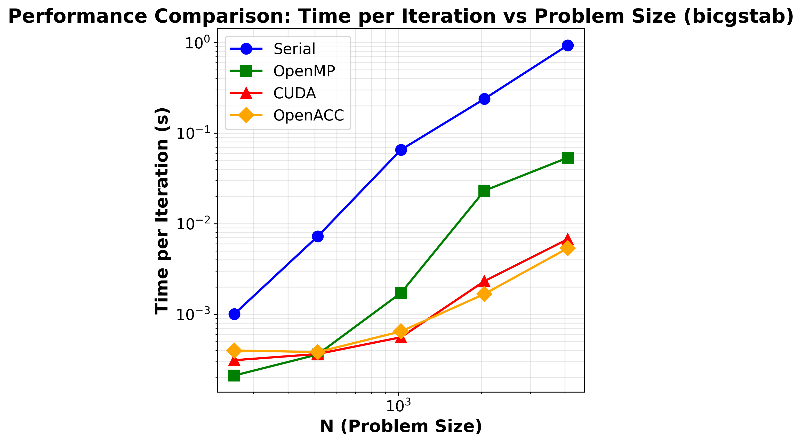
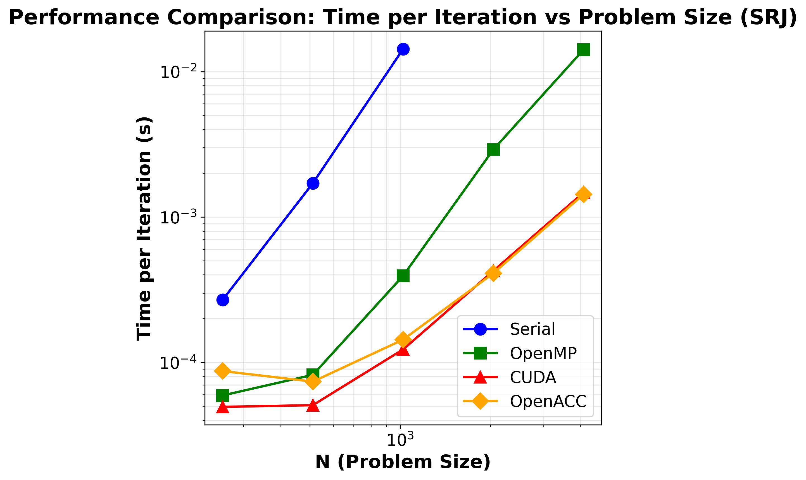

# MyPoisonCu

A high-performance 2D Poisson equation solver with support for multiple backends (CUDA, OpenACC, OpenMP, Serial) and various iterative solution methods.

## Overview

MyPoisonCu solves the 2D Poisson equation:
```
∇²φ = f
```
on a rectangular domain with configurable boundary conditions using finite difference methods.

## Features

- **Multiple Backends**: CUDA, OpenACC, OpenMP, and Serial execution
- **Multiple Solvers**: 
  - Jacobi iteration with relaxation
  - SRJ (Scheduled Relaxation Jacobi) with optimized relaxation parameters
  - BiCGSTAB (Biconjugate Gradient Stabilized) with preconditioning
- **Boundary Conditions**: Dirichlet, Neumann, and Periodic
- **Flexible Precision**: Single (float) or double precision support
- **RAII Design**: Automatic memory management with C++ classes
- **Unified Interface**: Single codebase for all backends

## Key Data Structures in OOP based design:

- Fields : Stores a 2 dimensional array, along with its size, operating range of inner grid points (as opposed to boundary points), and a device copy. Also contains dedicated functions for uploading to and downloading from the device, allocation and deallocation to both host and device. Template based design. 
- Operator : Left hand size 5 point operator for linear equation
  ```
  L(u) = f
  ```
  While I am not doing so, Operator should have had been made up of Fields.
- Solver : Made up of operator and relevant fields. Has all the information to solve the equation itself.. A mujlti grid method would be made up different Solvers at different levels. 
- Setup : Setup for the entire problem.

Overall, I have some regrets; would have been better to do unified memory as it would have allowed me to combine OpenACC and CUDA. But its fine. 

## Performance

### BICGSTAB, N = 4096, N×N = 16777216

| Method | Machine | Time per timestep (s) | Relative Speedup vs Serial | Relative Speedup vs OpenMP |
|--------|---------|----------------------|----------------------------|----------------------------|
| **Serial** | Intel Xeon Gold Cascade Lake 6248R (1 core) | 0.9342 | 1.00 | 0.06 |
| **OpenMP** | Intel Xeon Gold Cascade Lake 6248R (48 cores) | 0.0535 | 17.46 | 1.00 |
| **OpenACC** | Nvidia a100 | 0.0054 | 174.37 | 9.99 |
| **CUDA** | Nvidia a100 | 0.0067 | 138.57 | 7.94 |

### 1. BiCGSTAB
   


### 2. Scheduled Relaxation Jacobi
   


## Building

The project supports multiple build configurations:

```bash
# For CUDA
make -f Makefile.cuda

# For OpenACC
make -f Makefile.acc

# For OpenMP
make -f Makefile.omp

# For Serial
make -f Makefile.serial
```

### Build Options

- `USE_DOUBLE=1`: Enable double precision (default: single precision)
- `DEBUG=1`: Enable debug symbols and disable optimization

Example:
```bash
make -f Makefile.cuda USE_DOUBLE=1
```

## Usage

```bash
./mypoisoncu
```

The program reads configuration from `input.dat` and outputs:
- Solution files in Tecplot format to `TECOUT/` directory
- Convergence history to `HISTORY/` directory

## Performance

The solver automatically selects optimal thread/block configurations for GPU execution and efficiently handles data transfers between host and device memory. The unified calculator interface ensures consistent performance across all backends.

## Architecture

The code uses a modular design with:
- **Calculators**: Core computational kernels with backend-specific optimizations
- **Solvers**: Implementation of iterative methods
- **Data Structures**: RAII-based Field, Operator, and Solver classes
- **I/O**: Tecplot output and convergence history tracking
